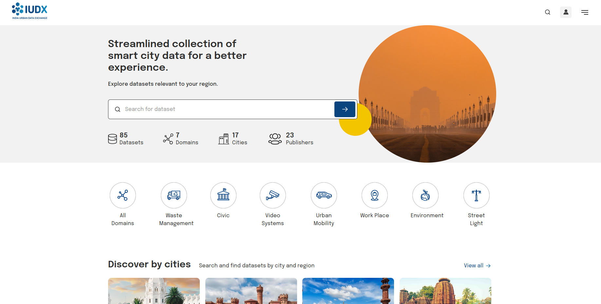
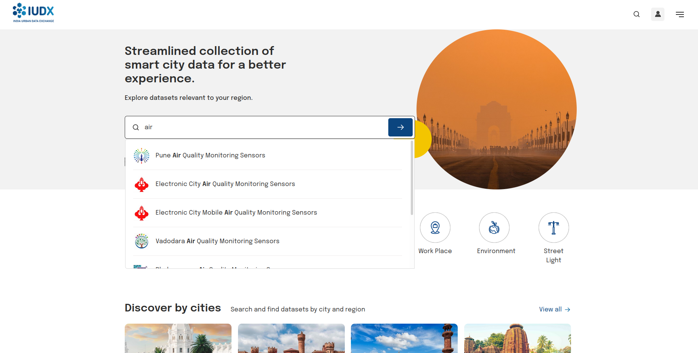
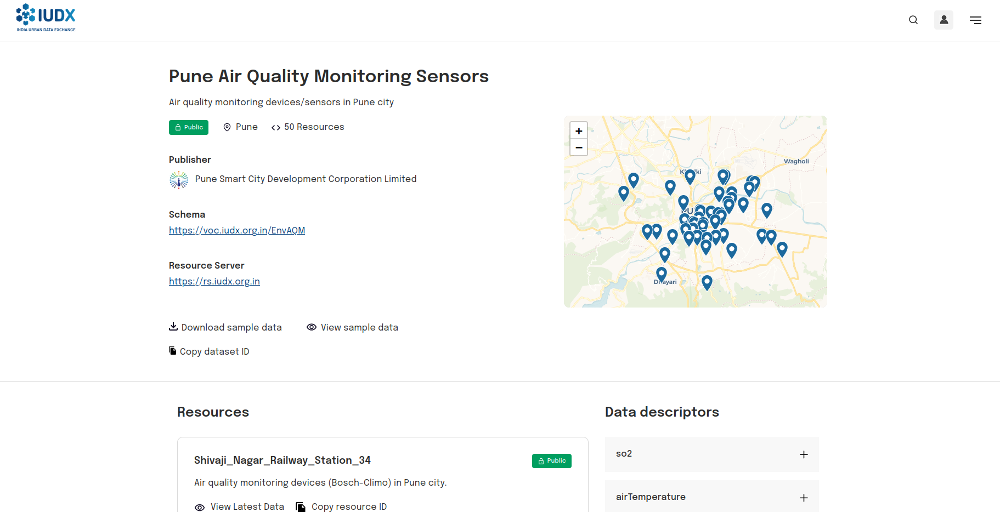

# Discover Resources
With the help of [Catalogue APIs](https://api.catalogue.iudx.org.in/apis), a `consumer` can access information related to availability of a resource using `spatial`, `attribute`, `text` and `relationship` search.

## Using IUDX Catalogue UI

A `consumer` can also use the [Catalogue UI](https://catalogue.iudx.org.in/) to discover resources. 

 
*Catalogue UI*

Using the `search text box`, a free text search can be performed. The UI will show the list of search results while typing a search query which can be viewed by scrolling them. If you are interested in a resource, you can select them by clicking the respective resource in the list. 

 
*Catalogue Text Search*

The Catalogue Resource Page provides information about a resource which includes information about a `Provider`, the resource server that serves the resource, the `data descriptor` of the resource, the `access type` of the resource etc.

 
*Catalogue Resource Page*

## Access Policies of a Resource
A resource can be either `Open` or `Secure`. If a resource is `Open`, it can be accessed via `APIs` and as `files` without any consent from a `Provider`. In case of `Secure` resources, access to `APIs` and `files` will be possible only with `Consent` from the `Provider`. 

By default, access to a resource via subscription and async APIs requires Consent from the provider. 

## APIs supported by a Resource
A `consumer` can use Catalogue Items APIs to understand the resource. For example, in [Surat Public Transit Bus Realtime Info](https://api.catalogue.iudx.org.in/iudx/cat/v1/item?id=suratmunicipal.org/6db486cb4f720e8585ba1f45a931c63c25dbbbda/rs.iudx.org.in/surat-itms-realtime-info/surat-itms-live-eta) resource, we can find information such as `dataDescriptor`, `location`, `iudxResourceAPIs`, `resourceType` etc which can be used to construct appropriate queries. Types of queries supported in a resource can be understood from `iudxResourceAPIs`

To access a resource, a `consumer` should [obtain an access token](./consumer_obtaining_access_token.md)