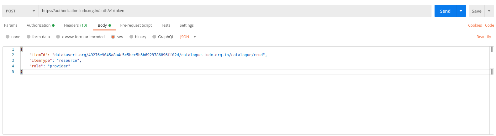

 
# Manage Catalogue Items

## Obtain Token to Create Catalogue
A provider needs to get a token to create a catalogue/update/delete a catalogue entry in the IUDX catalogue server from the IUDX Auth service(authorization.iudx.org.in). 
A provider can a obtain token using either by providing token header or providing clientId and clientSecret in the header and the payload mentioning the itemId, itemType and role.
The itemId provided will be of the format: <provider-domain>/<SHA1-of-provider-email>/<catalogue-url>/catalogue/crud, itemType provided will be: resource and role will be: provider.
For example, if the provider is provider.foobar@datakaveri.org, the itemId will be datakaveri.org/49276e9045a8a4c5c5bcc5b3b6923786896ff02d/catalogue.iudx.org.in/catalogue/crud
 
*Obtain Token for catalogue creation*

## Onboard Items in Catalogue
Assume that rS and Provider items are already created by IUDX Admin. 

Add the Cat API to use to upload items (rG and res)
Add scripts / screenshots (whichever applicable)
