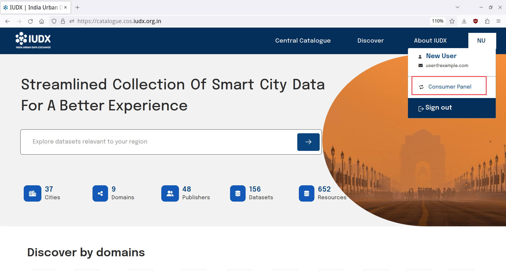
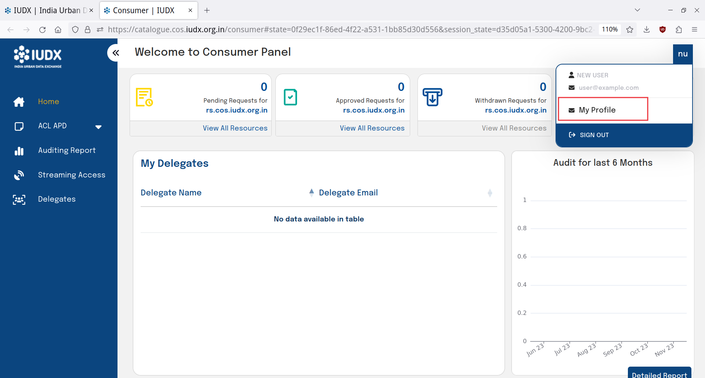

# Fetching and Resetting Client Credentials

Once you have registered as a consumer or have been approved as a provider, you may obtain your default client credentials.

1. Log into the catalogue and click on the top right button to enter your role panel.

 
*Entering into the consumer panel*

2. In your respective role panel, click on the top right button to enter into your My Profile panel.

 
*Entering into the My Profile panel*

3. The My Profile panel allows you to download your default client credentials or reset your default client credentials in case you have lost them or if they have been compromised.

4. **NOTE : Resetting client credentials will result in revocation of all existing tokens. Additionally, the old client secret will not be accepted in token requests.**

 
*Getting default client credentials*

 
*Downloading default client credentials*
