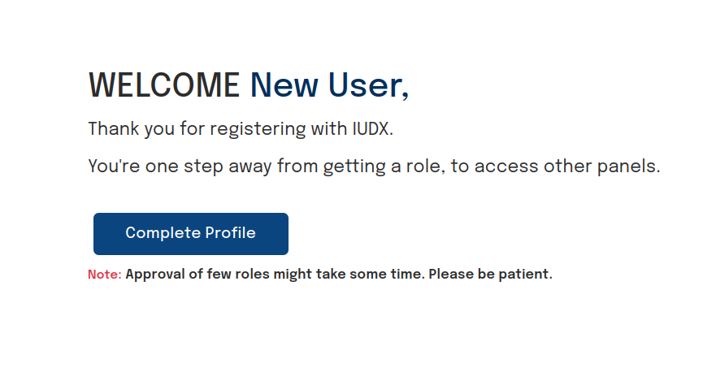
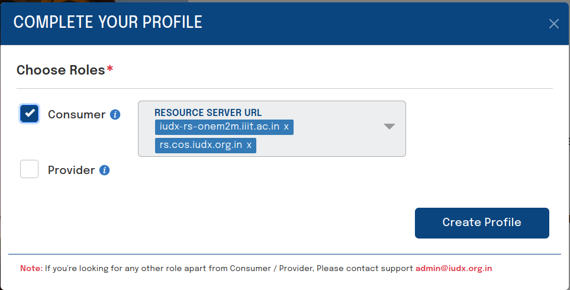

# Registration

## Introduction

All users of the IUDX platform must be registered and authenticated to perform any secure operation offered by the platform. The details of these secure operations are defined and explained by all IUDX components in their repective API documentation. The registration process of a guest user on the IUDX platform is a simple four step process as outlined below:

1. [Creating the Account](#1-account-creation)
2. [Verifying the Email Address](#2-email-verification)
3. [Assigning / Requesting a User Role](#3-requesting-user-roles)
4. [Generating the Client ID + Secret](#4-generate-client-id--secret)

## 1. Account Creation

On entering the Consumer or Publisher Panels, there is an option to register when you are prompted to sign in.

 
*Register*

Enter the required details.

 
*Account details*

## 2. Email Verification

You should receive an email at your registered address, with a verification link. On clicking the link, the account has been successfully linked to the email address.

 
*Email verification required*

 
*Sample email dialog*

 
*Account created, last step of registration pending*

## 3. Requesting User Roles

Once email verification is complete, you can now choose the roles you would like to have. Please note that Providers and Delegates are required to be associated with an organization registered with the IUDX platform. Please see below for more details.

 
*Choosing consumer role*

### Provider and Delegate Registration

Providers and delegates are required to be associated with an organization. In the second step of registration, when choosing those roles, it is necessary to also choose an organization when selecting either `provider` or `delegate` roles. 

**The registered email domain needs to match the chosen organization's domain.** For e.g., *delegate@datakaveri.org* may be able to register as a delegate associated with Data Kaveri organization (as the domain is datakaveri.org), but not with IISc (as the domain is iisc.ac.in). 

In case you plan to register for these roles, please choose the appropriate email address. Registering for the consumer role has no such restrictions.

**NOTE: Provider registration is subject to approval. A user registered with the provider role may be able to access the Publisher Panel once they have been approved**.

 
*Choosing provider/delegate role*

## 4. Generate Client ID + Secret

Finally, after specifying the roles required in the previous step, an autogenerated client ID + secret is presented. These credentials can be used to request for tokens via scripts or on the command line.

**Note: The client secret can only be viewed here when it is first generated and will not be visible in the future, so please download the CSV file and keep it safe.**

 
*Successful registration; client ID and client secret*
